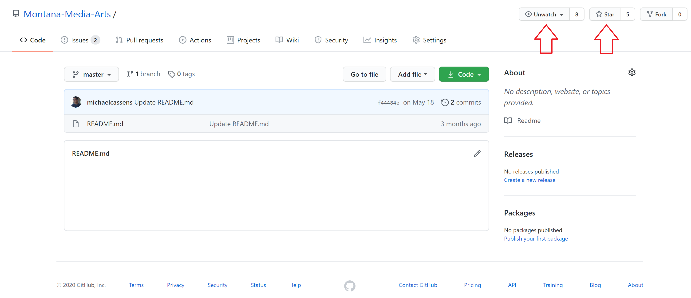

<!--# Get a clone on your local Machine-->

# _Issues Forum_ and Notifications from GitHub.com

<iframe class="embed-responsive-item" src="https://www.youtube.com/embed/jmwObsKJ3A4" frameborder="0" allowfullscreen></iframe>

This class is heavily utilizing [GitHub.com](https://github.com). Not only is this service where you will host your git repo's and live websites, but this content site lives in GitHub, and there is a "resources" repo for this site that contains;

- code examples for this course
- and an issue forum where you can ask each other for help.

## "Watch" and Star The Course Resource Repository

By "watching" the course repository, you will get notifications about new issues as well as when new resources become available.

To watch the course repo:

- Navigate to [Examples Website](https://github.com/Montana-Media-Arts/120_CreativeCoding1-Fall2020-Samples/). The issues forum for this site also links to the "Issues-Forum" tab above in the navbar.
- In the upper right-hand corner, you should select both "watching" and "star".
    - The star and watching allow GitHub to email you about notifications and issues in the course repo.
    - **Participation is part of your grade in this course. The followings out how you participate.**
        - When you have problems, please post them in the issues area.
        - If you get an email about a new issue, try to help the person out.

## Create a new "Issue"

To create or respond to an issue, open the repo ["Issues Forum"](https://github.com/Montana-Media-Arts/120_CreativeCoding1-Fall2020-Samples/issues).

There you can search open issues to try and;

- get yourself help
- or help a colleague

If no issue matches your problem, you can open a "New Issue". Creating a new issue allows you to describe your problem, thereby providing everyone in the class a message and hopefully helping them work on it.

NOTE: You should not repeat a comment that has already been added by anyone from your class. However, if you would like to further a comment already there, type in "@mention" the classmate/user and continue their discussion, which works well.

# Create your own GitHub repository

<iframe class="embed-responsive-item" src="https://www.youtube.com/embed/FV4j1YkNSlo" frameborder="0" allowfullscreen></iframe>

You want to create your repository if you don't have one. 
1. Go to ([GitHub](https://github.com))
2. Create an account by clicking Sign up for GitHub.
3. View your repositories.

# GitHub Desktop

<iframe class="embed-responsive-item" src="https://www.youtube.com/embed/kNPGX-YDvw8" frameborder="0" allowfullscreen></iframe>

GitHub Desktop is a graphical interface to make a copy of your repository on your computer.  Then, you can make changes to your work and then quickly post it back to your repository.  Or if you heaven forbid something happens to your computer [trust me, it happens], then you have a backup.

1. Go to ([GitHub Desktop](https://desktop.github.com/))
2. Download your version and install it.
3. Go to your repository and click on the clone or download button. 
4. Click on Open in Desktop.
5. Create a clone on your computer.
6. Remember to pull first **always** and then push.
