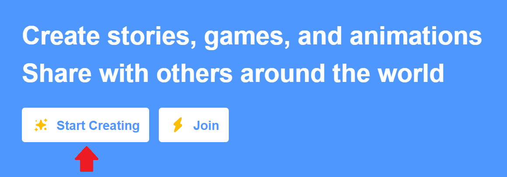

# Overview of Scratch

## What is Scratch

<iframe class="embed-responsive-item" src="https://www.youtube.com/embed/bMaZ7m0yiVI" frameborder="0" allowfullscreen></iframe>

Scratch is a programming paradigm developed by MIT. Initially, Scratch taught the younger generation how to program visually.  I find that Scratch is highly interactive, and we can create things much faster, and it's fun, too, regardless of your age.  It gives us more flexibility than Code.org, but we are using the same drag-and-drop method program.

Remember to keep a close eye on what those commands are saying so that when you move into a written programming language, you will be able to make parallels between the two.

First, go to [Scratch Website](https://scratch.mit.edu/)

You can sign up for an account and create or download an offline version and build it on your computer without an internet connection.

Click on the `Start Creating`, and that will take us to the application.

After you click Start Creating, you should see a new page that has the Scratch cat.  You are welcome to go through the tutorials as they will not hurt you, but they are not required.