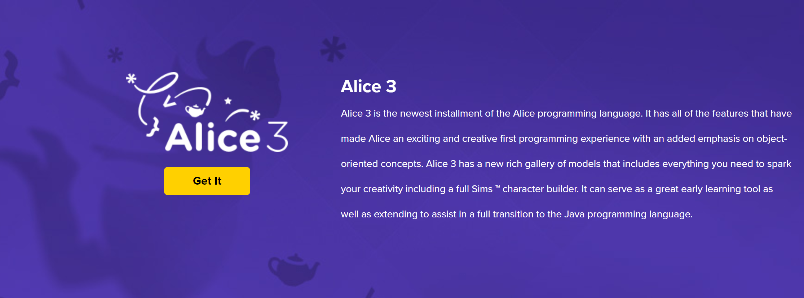

# Alice Download

<iframe class="embed-responsive-item" src="https://www.youtube.com/embed/NyjWGMmJpVo" frameborder="0" allowfullscreen></iframe>

If you haven't already, What you want to do is go to <a href="http://www.alice.org" target="_new">Alice.org</a> and get your specific version. All major platforms are supported, and it's free!  There's nothing wrong with that. 

First, click on `Get it`.

The screen presents the download options.  Choose the option that fits your configuration. If you have a newer Windows machine, you should have 64-bit; otherwise, 32-bit will work. Just keep in mind that it will run a little slower.

